# TP NGS Clownfish

Readme du projet NGS Marthe 

## Specie: _Amphiprion ocellaris_ 

## Problem of interest: 
Compared to mammals that only have one pigment cell type (melanocytes), actinopterygians fishes harbor at least eight types of pigment cells (melanophores, iridophores, xanthophores, ect.). Our study focus on the clownfish _Amphiprion ocellaris_, which exhibits a specific color pattern of vertical white bars alternate with orange bars. We conduct a transcriptomic analysis of the fish skin in order to determine the genetic basis of this pattern and the type of pigment cells implicated in the white tissue (iridophores or leucophores). The presence of the gene _saiyan_ would potentially inform on the presence of iridophores in white skin. 

**Reference paper**: Salis, P, Lorin, T, Lewis, V, et al. Developmental and comparative transcriptomic identification of iridophore contribution to white barring in clownfish. _Pigment Cell Melanoma Res._ 2019; 32: 391– 402. https://doi.org/10.1111/pcmr.12766

## Data-set: 
For each skin color (orange and white), 3 individuals have been sampled: 3x2 = 6 samples. Each sample has been sequenced using Illumina Single-End (50 bases reads).

---
## Analyses steps:
### 1) Raw RNA-seq data download. 

  * **Downloading the data from the NCBI database**. The reads are available on NCBI database, under BioProject PRJNA482393 and BioProject PRJNA482578. Our 6 samples of interest can be found from SRR7591064 to SRR7591069. See the script `RNAseq_data_download.sh`. We download fastq files stored in a SRA_data_folder.
  See the image below for an example of how a fastq file looks:
  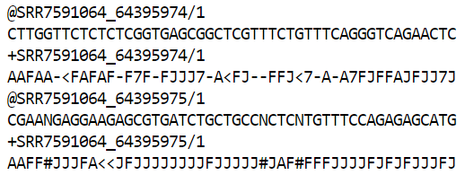
  
    One read is four lines, with the first line carrying the name of the read, the second line carrying the genetic code, the third line is the name again and the fourth is the ASCII code that informs on the reliability of the sequencing associated to each nucleotide. The "/1" after the name of the read indicade that the single read is sequenced as anti-sense (reverse(R)).

  * **Control of the quality of the reads using FASTQC function**. See the script `fastqc.sh`. To better understand the fastq format and how to check the data quality, see the page: https://en.wikipedia.org/wiki/FASTQ_format/
  
    For each file we obtained the basic statistics, per base sequence quality, per sequence quality scores, per base sequence content, per sequence GC content, per base N content, sequence lenght distribution, sequence duplication levels, overrepresented sequences and adapter content. 
  See the image below for an example of basic statistics for one file:
  
    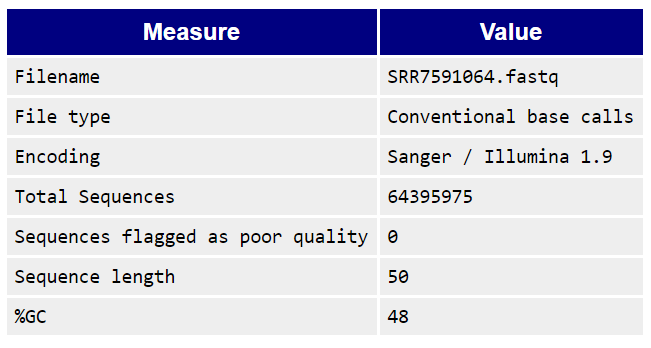

  * **Assembly and comparison of all the FASTQC quality reports for all the sequences using MULTIQC function**. See the script `multiqc.sh`.The quality of the data is very good (see image below) so no need to clean them.
  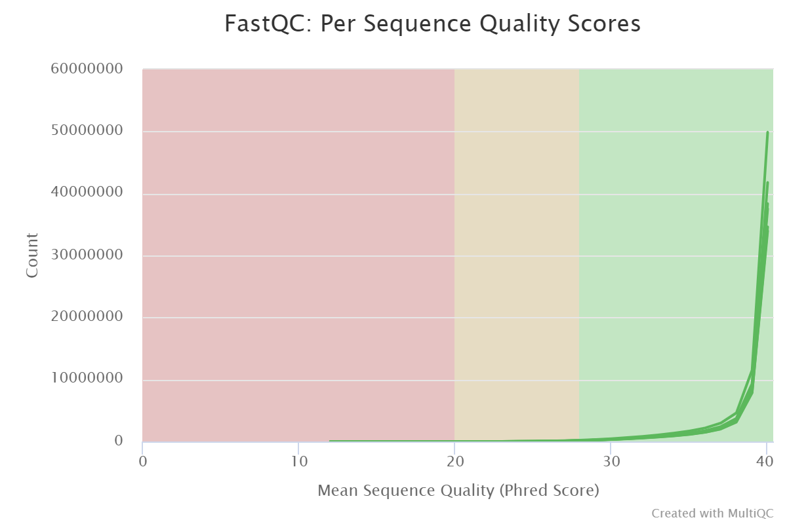

### 2) Data assembly
  * **Assemby of the reads using TRINITY**. See the script `trinity.sh`. The reads are then assembled into a FASTA file. To get to know how to use trinity, see the page: https://github.com/trinityrnaseq/trinityrnaseq/wiki/Running-Trinity. Basically, Trinity combines three modules: Inchworm, Chrysalis and Butterfly, that together assemble reads in linear sequences, then make a graph and distribute the reads between clusters for each gene, and finally reconstruct isoforms and separate paralogs. One should use the `nohup` command to run the script because Trinity can take long.
  
    See the image below for an example of how a fasta file looks:
  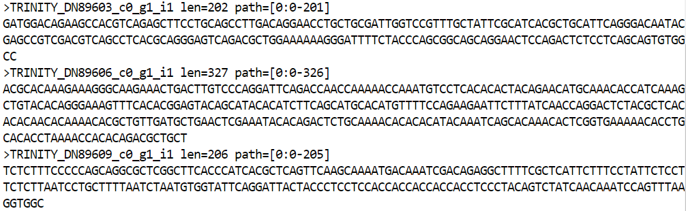
  
    The first line begin with ">" and indicate the name of the read, then follow the genetic code of the sequence. 

### 3) Transcript expression quantification
  * **For each transcript, we determine with SALMON whether it is more express in white skin or orange skin**. See the script `salmon.sh`. To get to know how to use salmon, see the page: https://salmon.readthedocs.io/en/latest/salmon.html. Based on the assumption that the more reads a gene has, the more expressed he is, Salmon index the transcriptom from our fasta files (output of Trinity) and then quantify the expression of the transcripts from the index and fastq files. 
  
    See the image below for an example of salmon quantification table:
  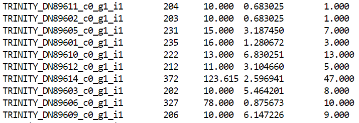
  
    The first column indicates the name of the transcript assemble by Trinity.
    The second column indicates the lenght of the transcript and the third column the effective lenght.
    The fourth column indicates the TPM (transcripts per million), which is the total number of reads normalized by the overall lenght.
    The last column indicates the number of reads associated with the transcript.
  
### 4) Data annotation
  * **Get a genome of reference**: downloading of the genome of _Stegastes partitus_ that was the closest sequenced genome of the clownfish at the time of our paper (Salis et al., 2019). See the script `get_stegastes.sh`. The script `Rename_stegastes.awk` renames the downloaded sequences (to execute this script, use the command `awk`). The command `gunzip` followed by the file name unzip the downloaded genome. 
  
  * **Recover proteomic data from our transcripts with TRANSDECODER**, as coding regions are the most conserved sequences accross species and thus are already associated to a known function. See the script `transdecoder.sh`. To get to know how to use TansDecoder, see the page: https://github.com/TransDecoder/TransDecoder/wiki.

    Rename Transdecoder's output files before the blast with the line:
`awk '{print $1}' Trinity.fasta.transdecoder cds > rename.cds`

  * **Detect the homologies between our transcripts (coding sequences of _Amphiprion ocellaris_) and references genes (genome of _Stegastes partitus_) using BLAST.** See the script `blast.sh`. 
    
    See the image below for an example of blast output:
  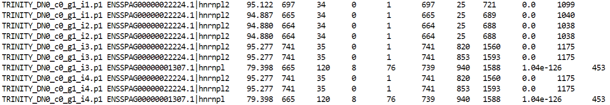
  
    The first column indicates the name of the trinity transcrit and the second column the corresponding sequence in the reference genome. The blast e-value, indicated in the 9th column, is the number of expected hits of similar quality (score) that could be found just by chance. The smaller the e-value, the better the match. The last column indicates the bit score, the higher the bit-score, the better the sequence similarity. To understand columns in blast table more precisely, see: http://www.metagenomics.wiki/tools/blast/blastn-output-format-6. 

    The command `cut -f1 blast |sort |uniq |wc -l` allows to see how many hit the blast found. 
  
### 5) Differential expression analysis

  Salmon quantified the number of reads for each transcript on the six samples, which means now we have three values for each read: 3 values per transcript on white skin and 3 values per transcript on orange skin. Because our analyses includes few replicates (only three individuals), the **DESeq** tool allows a statistical analysis of the differential expression. See the script `DeSseq2.R`. To learn how to use best DESeq, go to: https://www.bioconductor.org/packages/devel/bioc/vignettes/DESeq2/inst/doc/DESeq2.html.
    
  For a more powerful analyses, we withdraw poorly expressed genes that aren't characteristics of our analyses in order to reduce the number of tests. The white skin is settled as the reference in statistical tests. 
    
  See the picture below for the 10 transcripts that are the most differentially expressed between the white and orange skin:
  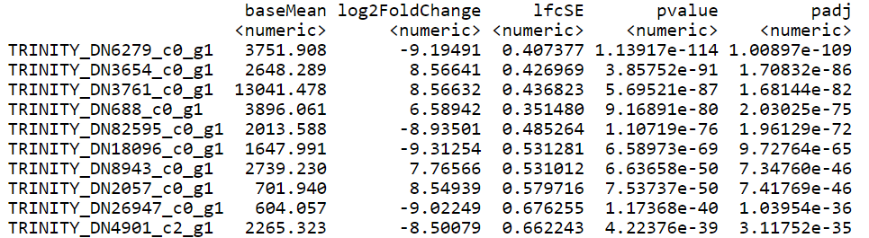
  
  -> The _BaseMean_ indicates the intensity of the signal (the bigger the basemean, the more the gene is expressed).
  
  -> The _log2(foldchange)_ indicates the ratio of variation between the two conditions (orange skin/white skin). The log2 transforms the fold change so that a log2(foldchange) = 0 means the gene is expressed similarly in the two skin types. Compared to the white skin condition, the gene is underexpressed if log2(foldchange) < 0 and overexpressed if log2(foldchange) > 0.
  
  -> The _lfcSE_ is the standard variation of the log2(foldchange).
  
  -> _Stat_ indicates the statitic of the test.
  
  -> _P-value_ indicates the p-value of the test and _P-ajd_ indicates the p-value adjustated with the false discovery rate (FDR). FDR is a DESeq tool that corrects the rate of type I errors in null hypothesis testing when conducting multiple comparisons. FDR is designed to control for the expected proportion of "discoveries" (rejected null hypotheses) that are false (incorrect rejections of the null). Typically, FDR of 0.1 means that there is a chance that 10% of the genes are not false positive, i.e. if 100 genes are differentially expressed, then about 10 genes are false positive. Basically, it is calculated this way: FDR = (area of H0)/(area of H0 + H1). This analyses was conducted with FDR = 0.05.
  
  * The Maplot below shows the intensity of the signal according to the differential expression for each gene:
  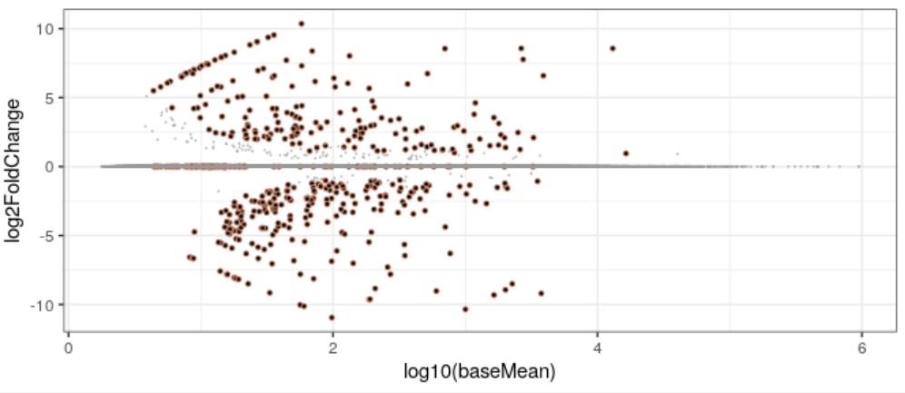
  
    The genes differentially expressed have a very high or very low log2(foldchange). Note that the foldchange is not independant from the basemean: the little counts artificially increase the foldchange. The function `lfcShrink` helps fix this. 
  
  
  * Another representation is the Volcanoplot, that shows the p-value adjusted as a function of the log2(foldchange).
  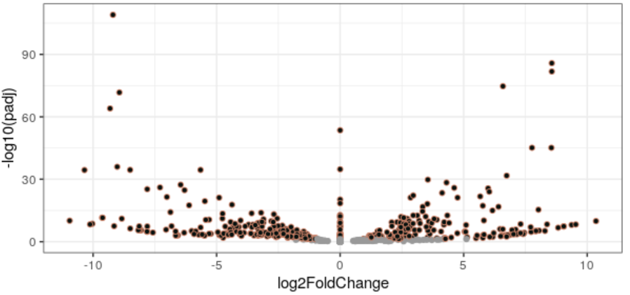
  
    The genes differentially expressed have a higher -log10(p-adj). When the foldchange is negative the genes are underexpressed compared to white skin, when the foldchange is positive the genes are overexpressed compared to white skin.

  * A principal component analysis allows to visualize the separation between samples according to the skin color: 
  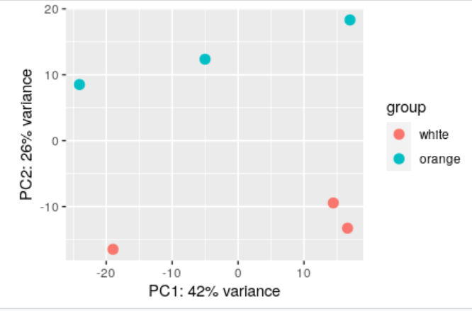
  
    It is interesting to note that the first component seems to separate individuals within a same skin color. This is probably due to our low sample size and genetic interindividual differences. 

  * **Manual annotation of top differentially expressed genes and conclusion:**
  
    From our table with the 10 most differentially expressed genes (so the lower p-adj), we took the trinity transcript ID that we blasted to recover the corresponding Ensemble ID. Then, in the **ensembl.org** database, we found the corresponding name of the gene and manually placed them on the volcano plot according to their p-ajd. See the result obtained below: 
    
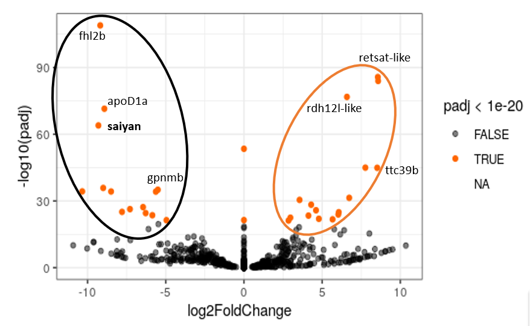

(source: Vinciane Piveteau)

To conclude, our results are consistent with the ones of the original study. Indeed, 7 of our 10 most differentially expressed genes are found in the paper's 10 most differentially expressed genes, including _Saiyan_, a gene of particular interest for the white pigmentation of the skin. 

Interestingly, our analyses differ in some ways from the original study. For example, in the statistical analyses, we used the function `lfcShrink` whereas the authors used the function `results`. Moreover, some options used in our scripts may differ and updates of the softwares between the time the paper was written and December 2020 might explain slight differences. Finally, the annotated genome of _Amphiprion ocellaris_ is now available online, so one could avoid the step with dowloading the reference genome of _Stegastes partitus_. 

